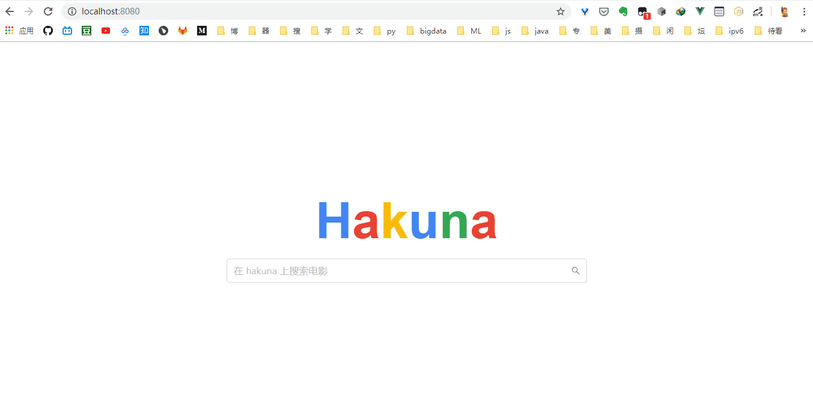

# hakuna电影搜索引擎（mini）
> scrapy+elasticsearch+flask+vue

just for fun,for learn.



### how to run？
```
# 安装中文分词插件ik
# https://github.com/medcl/elasticsearch-analysis-ik
> elasticsearch-plugin install <>
# 启动elasticsearch
> bin/elasticsearch

# 设置虚拟环境
> python -m venv env
> source env/bin/activate
> pip install -r requirements.txt

# 启动爬虫
# 数据自动送入elasticsearch
scrapy crawl douban

# server
> python app.py

# client
> npm install
> npm run serve

# 访问: localhost:8080
```

### mini系列
[mini_todo](https://github.com/shiniao/mini_todo)——基于 go 语言的 todo restful-api 实践(gin+vue)

[mini_sms_classify](https://github.com/shiniao/mini_sms_classify)——小型垃圾邮件分类系统（naive_bayes+flask+vue）

[mini_mnist](https://github.com/shiniao/mini_mnist)——mini手写数字识别(CNN+flask+vue)

### 联系我
email: zhuzhezhe95@gmail.com